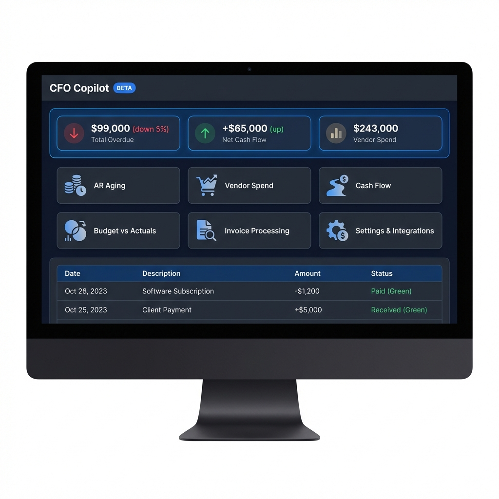

# Enterprise Copilot Starter 🚀

A production-ready template for building AI-powered enterprise applications. This starter kit provides a robust architecture for connecting generic Large Language Models (LLMs) with enterprise data sources, featuring a modern UI, data security patterns, and persona-based workflows.

Currently configured as a **CFO Copilot** demo, this template can be easily adapted for Sales, Recruiting, Operations, or any other domain.



## ✨ Features

*   **Modern Tech Stack**: Built with React, Vite, TypeScript, and Tailwind CSS.
*   **Modular Architecture**: Clean separation of UI, Data (MCP), and AI layers.
*   **Multi-Source Data Integration**:
    *   Pre-configured pattern for **Sage Intacct**.
    *   Stubs for **NetSuite**, **QuickBooks**, **Dynamics GP**, and **SQL Server**.
*   **Enterprise Security**:
    *   **Data Masking**: PII (SSN, Bank Accounts) is automatically masked.
    *   **Role-Based Views**: Persona selector for tailored experiences.
*   **AI-Ready**: Structured prompt engineering context and mocked LLM service integration.
*   **Responsive Design**: A beautiful, dark-mode, responsive UI with animations.

## 🛠️ Tech Stack

*   **Frontend**: [React 18](https://reactjs.org/)
*   **Build Tool**: [Vite](https://vitejs.dev/)
*   **Styling**: [Tailwind CSS](https://tailwindcss.com/) + [Lucide Icons](https://lucide.dev/)
*   **Language**: [TypeScript](https://www.typescriptlang.org/)

## 🚀 Getting Started

### Prerequisites

*   Node.js (v18 or higher)
*   npm or yarn

### Installation

1.  **Clone the repository**
    ```bash
    git clone https://github.com/YOUR_USERNAME/enterprise-copilot-starter.git
    cd enterprise-copilot-starter
    ```

2.  **Install dependencies**
    ```bash
    npm install
    ```

3.  **Run the development server**
    ```bash
    npm run dev
    ```

4.  **Open your browser**
    Navigate to `http://localhost:5173` to see the application.

## 📖 Customization

This repository includes a comprehensive guide on how to adapt this template for other uses (e.g., Sales Copilot, Recruiting Assistant).

👉 **[Read the Customization Guide](./TEMPLATE_GUIDE.md)**

## 📂 Project Structure

```
src/
├── components/       # UI Components (Dashboard, Layout, Results)
├── lib/
│   ├── mcp.ts       # Data Layer & Mock definitions
│   ├── llm.ts       # AI Service & System Prompts
│   ├── types.ts     # TypeScript Interfaces
│   └── templates.ts # Pre-defined Query Templates
├── App.tsx          # Main Application Logic
└── main.tsx         # Entry Point
```

## 🔒 Security Note

This template includes basic data masking for demonstration purposes (`mcp.ts`). For production use, ensure you implement robust authentication and server-side data sanitization.

